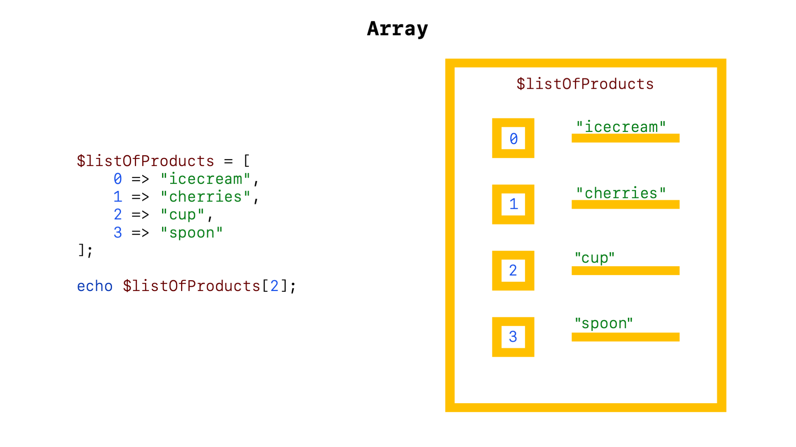
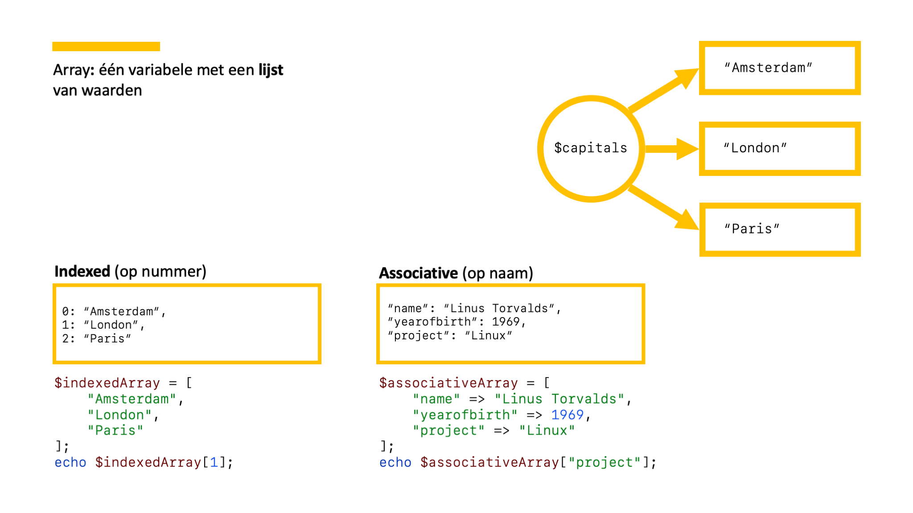

## Slides





[[pdf](./php-basis-array.pdf)][[pptx](./php-basis-array.pptx) (bronbestand)]

## Beschrijving

Array is een [datatype](../php-basis-datatype) van een variabele dat
meerdere waarden kan bevatten. Je kunt het zien als een lijst van
waarden.

Arrays bestaan uit key => value paren.

### Twee soorten arrays: indexed en associative

Bij een **indexed** array is de key een integer. Bij een
**associative** array is de key een String.

## Voorbeeld

### Indexed array

Bij het maken van een indexed array hoef je zelf niet de keys op te
geven. Die genereert PHP zelf:

```php

$capitals = ["London", "Amsterdam", "Paris"];

```

Is hetzelfde als:

```php
$capitals = [
    0 => "London",
    1 => "Amsterdam",
    2 => "Paris"
];
```

"Amsterdam" op het scherm tonen:

```php

echo $capitals[1];

```

**LET OP** De index begint met tellen bij 0

### Associative array

Deze array wordt gebruikt om key-value paren in op te slaan. Je
'associeert' (koppelt) waarden met keys. De waarden zijn vervolgens op
te vragen op basis van de key in plaats van de index bij een indexed
array. Bijvoorbeeld:

```php
$person = [
    "name" => "Linus Torvalds",
    "born" => "Helsinki",
    "project" => "Linux"
];
```

Wat zou onderstaande code weergeven op het scherm?

```php
echo $person["name"] . " is known for " . $person["project"];
```

### Arrays in arrays

Een array kan waarden van elk datatype bevatten. Dus kan een array ook
in een andere array zitten.


#### Voorbeeld 1
```php
$capitals = [
    ["Amsterdam", "Netherlands", 869709],
    ["London", "United Kingdom", 8674713],
    ["Paris", "France", 2249975]
];

echo $capitals[0][0] . " has a population of " . $capitals[0][2];
```

#### Voorbeeld 2

```php
// lijst met persoonsgegevens. Elk item in de array $personen is ook weer een array
$persons = [
    ['firstname' => 'Napoleon', 'lastname' => 'Bonaparte'],
    ['firstname' => 'Willem', 'lastname' => 'van Oranje'],
    ['firstname' => 'Horatio', 'lastname' => 'Nelson']
];

// toon 'Willem van Oranje' op het scherm
echo $persons[1]['firstname'] . ' ' . $persons[1]['lastname'];
```

## Externe Documentatie
De officiële PHP documentatie mbt arrays vind je op:

https://php.net/array
