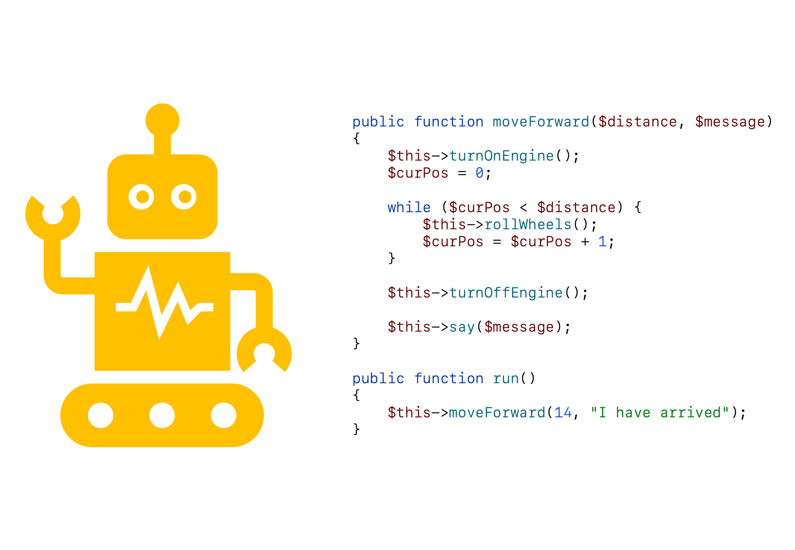

## Slides



### Downloads

[[pdf](php-basis-function.pdf)] [[pptx](php-basis-function.pptx) (bronbestand)]

## Beschrijving

Je zit midden in je online spel blikken gooien. Je raakt elke keer een aantal blikken. Het spel houdt je score bij en moet dus elke keer een getal optellen bij je score, dit opslaan in de database en je nieuwe score op het scherm tonen. Waarschijnlijk wordt dit gedaan door elke keer slechts één *functie* aan te roepen. Een functie als *addPointsToScore* die al de benodigde instructies bevat.

Met een functie kun je een blok code (meerdere instructies) schrijven die je zo vaak kunt uitvoeren als nodig is. Vaak hebben functies `input`, doen ze iets met die input, en geven ze het resultaat terug als de `output`.

Deze uitleg gaat ervan uit dat je programmeert binnen **classes** zoals gebruikelijk is binnen het Laravel framework.

Je hebt twee stukken code nodig voor een functie: de **definitie** en de **aanroep**. In de definitie schrijf je de code die je functie moet uitvoeren. Maar de functie wordt dan nog niet uitgevoerd. Het uitvoeren gebeurt pas bij de **aanroep**.

### Een voorbeeld

```php
public function sayHello()
{
    echo "Hello!";
}
```

Het tweede deel, de aanroep, ziet er uit als onderstaande code die je in een andere functie in je class kunt zetten.

```php

$this->sayHello();

```

## Parameters

Bovenstaand voorbeeld laat wat zien op het scherm, maar gebruikt nog geen `input`. Input kun je aan functies meegeven met `parameters` (ook wel *argumenten*). Deze geef je als variabelen mee tussen de haakjes achter de functienaam:

```php
public function sayHello($name)
{
    echo "Hello " . $name;
}
```

Binnen een andere functie in je class kun je bovenstaande functie uitvoeren met de volgende code:

```php

$this->sayHello("Elliott Erwitt");

```

## Probeer zelf

Zoek zelf uit hoe je meerdere parameters mee kunt geven en gebruiken binnen je functie.

## Return

Een belangrijke call binnen functies is `return`. Met `return` kun je de `output` van je functie terugsturen naar de code die de functie aanroept.

**LET OP**: `return` stopt de functie en stuurt het resultaat
terug. Code binnen een functie die na `return` staat wordt niet
uitgevoerd.

## De ene functie kan de andere uitvoeren

Een functie kan ook een andere functie uitvoeren. Kijk maar eens naar onderstaande code. Kijk maar eens naar de functie `doHeadline()`:

```php
public function say($text)
{
    echo $text;
}

public function getHeadline($text)
{
    return "<h1>" . $text . "</h1>";
}

public function doHeadline()
{
    $this->say($this->getHeadline('Salvador Dali had a mustache'));
}
```

## Externe Documentatie

De officiële documentatie van PHP functions kun je vinden op:

https://www.php.net/manual/en/functions.user-defined.php

