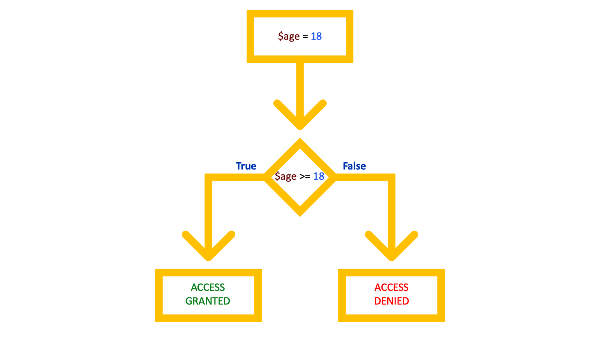

## Onderdeel van
Deze pagina is onderdeel van het **PHP basiskennis**
onderwijsmateriaal.

Voor een overzicht, ga naar **[PHP Basis: Overzicht](../php-basis)**.

## Slides



### Downloads

[[pdf](php-basis-if.pdf)] [[pptx](php-basis-if.pptx) (bronbestand)]

## Beschrijving

Bij een game kan het zijn dat je pas naar een volgend level mag als je
het vereiste puntenaantal bereikt hebt. Een rij-examen mag je pas
aanvragen als je 17 jaar oud bent. 

Heel vaak komt het voor dat je een bepaalde functionaliteit of
resultaat wilt teruggeven op basis van de situatie. Is de bezoeker 17
jaar oud? Dan dit. Anders dat.

Daarvoor kun je gebruik maken van `if` statements.

```php
$age = 13;

if ($age >= 18) {
    echo "U heeft toegang";
} elseif ($age > 12 && $age < 18) {
    echo "Even aan je moeder vragen!";
} else {
    echo "Je hebt geen toegang";
}
```
## Externe Documentatie

De officiële documentatie mbt if-statements vind je op:

https://php.net/if

