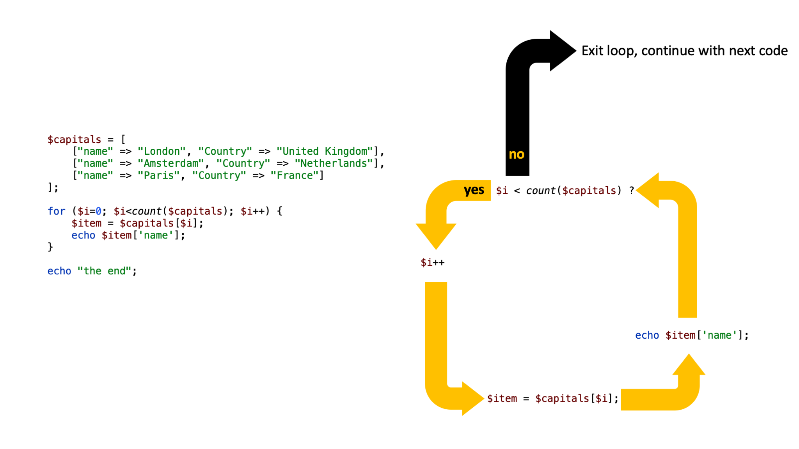

## Onderdeel van
Deze pagina is onderdeel van het **PHP basiskennis**
onderwijsmateriaal.

Voor een overzicht, ga naar **[PHP Basis: Overzicht](../php-basis)**.

## Slides



### Downloads

[[pdf](php-basis-loop.pdf)] [[pptx](php-basis-loop.pptx) (bronbestand)]

## Beschrijving

Met loops kun je herhalende acties uitvoeren. Je kunt bijvoorbeeld voor elk item in een lijst (bijvoorbeeld een array) met studenten hun voornaam op het scherm tonen.

In PHP zijn drie soorten loops beschikbaar: for, foreach en while.

Veel programmeertalen beschikken slechts over for en while.


## foreach
### Indexed array

```php
$gereedschapskoffer = ['hamer', 'schroevendraaier', 'boormachine'];

foreach ($gereedschapskoffer as $item) {
    echo "<li>" . $item . "</li>";
}
```

### Associative array 

```php
$myArr = [
    'naam' => 'Epictetus',
    'leeftijd' => 24,
    'woonplaats' => 'Rome'
];

/**
 * toon elke key en waarde van $my_arr op het scherm
 */
foreach ($myArr as $key => $value) {
    echo "$key=$value\n"; // \n is een newline (volgende regel)
}
```

Wat zou er gebeuren als je een foreach met $key => $value gebruikt in combinatie met een indexed array? Probeer dat eens!

## for

tien maal 'Ik ga thuis oefenen met PHP' op het scherm tonen

```php
for ($i = 0; $i < 10; $i++) {
    echo "Ik ga thuis oefenen met PHP\n";
}
```

## while

zoek "Zeno" in een lijst met namen

```php
$lijst = ["Salomon", "Zeus", "Zeno", "Socrates"];
$zoek = 'Zeno';
$found = false;
$pos = 0;

while (! $found) {
    if ($lijst[$pos] === $zoek) {
        $found = true;
    }

    $pos++;
}

if ($found) {
    echo "Ja, gevonden op positie " . $pos . "!\n";
}
```