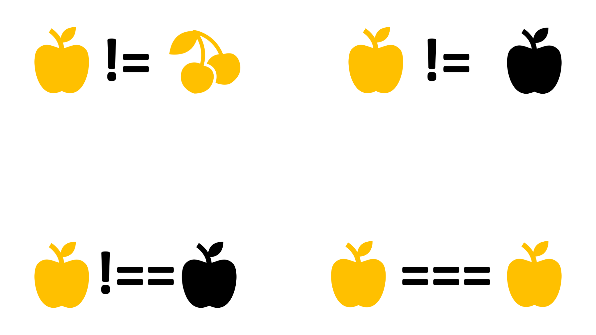
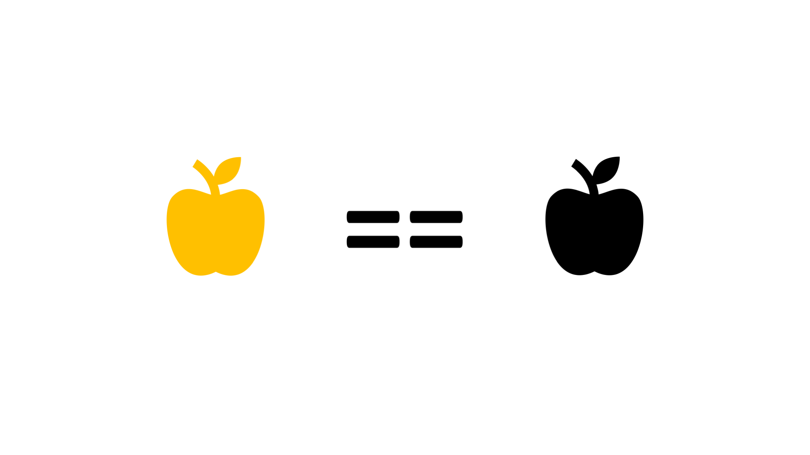
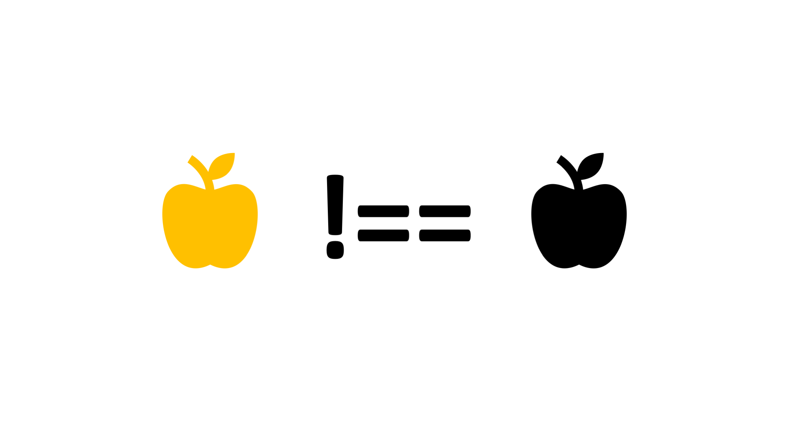
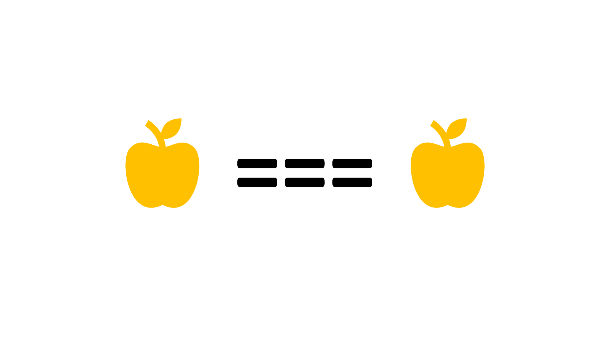

## Slides

De waarde van appel komt niet overeen met die van kersen


De waarde van een appel 1 is gelijk aan die van appel 2


Appel 1 is niet identiek aan appel 2


Appel 1 is wel identiek aan appel 1


### Downloads

[[pdf](php-basis-operators-is.pdf)] [[pptx](php-basis-operators-is.pptx) (bronbestand)]

## Beschrijving

In PHP bestaan drie `operators` voor het woordje "is": =, == en
===. Maar wanneer gebruik je nu welke?

### Toekennen

= gebruik je om een waarde op te slaan in een variabele (ook wel het
"toekennen" van een waarde aan een variabele):

```php

$country = "Atlantis";
$location = "unknown";

```

Wil je weten **of** een variabele een bepaalde waarde heeft? Dan ben
je aan het **vergelijken**.

### Vergelijken

Allereerst, knoop dit in je brein bij het vergelijken van variabelen:

> **gebruik ===** tenzij je een goede reden hebt om **==** te
> gebruiken.

Want: wat verwacht jij dat bij onderstaande code op het scherm getoond
wordt?

```php
$a = 1;

$b = True;

if ($a == $b) {
    echo "Same";
} else {
    echo "Different";
}
```

Kennelijk hebben 1 en True dus dezelfde **waarde**. Toch zijn ze niet
identiek. Je bent een **integer** met een **boolean** aan het
vergelijken. Appels vergelijk je toch ook niet met peren?

Eigenlijk gaat deze vergelijking alleen betrouwbaar goed als beide
kanten van de vergelijking hetzelfde datatype hebben.

**Probeer eens**:
* 0 met "" te vergelijken
* 0 en "0"?
* "" en "0"?

In de meeste gevallen wil je weten of twee variabelen **identiek**
zijn. Variabelen zijn identiek als ze een gelijke waarde EN een gelijk
datatype hebben. Daar gebruik je **===** voor.

```php
$a = 1;

$b = True;

if ($a === $b) {
    echo "Same";
} else {
    echo "Different";
}
```

Wat toont bovenstaande code op het scherm?

> Nogmaals: **gebruik ===** tenzij je een goede reden hebt om
> **==** te gebruiken.

### Ontkenning

Soms wil je niet weten of iets gelijk is aan, maar juist of iets
**on**gelijk is aan ...

Zowel === als == kun je ook "omdraaien" met: **!** (!== en !=):

```php
// als userId niet 1 is, stop het programma.
if ($userId !== 1) {
    exit();
}
```

## Externe Documentatie

De officiële documentatie mbt vergelijkingsoperators (comparison
operators) vind je op:

https://www.php.net/manual/en/language.operators.comparison.php
