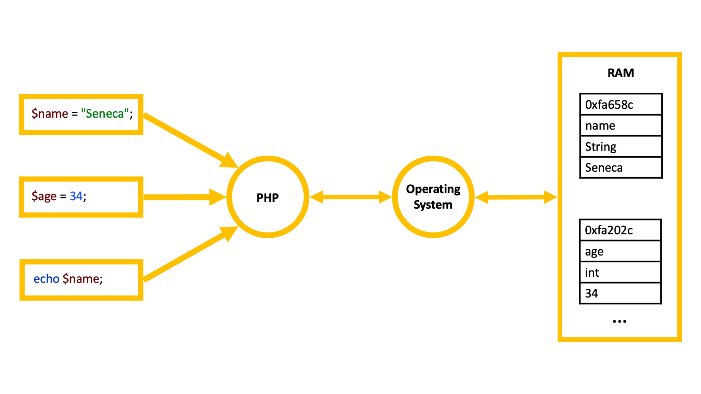
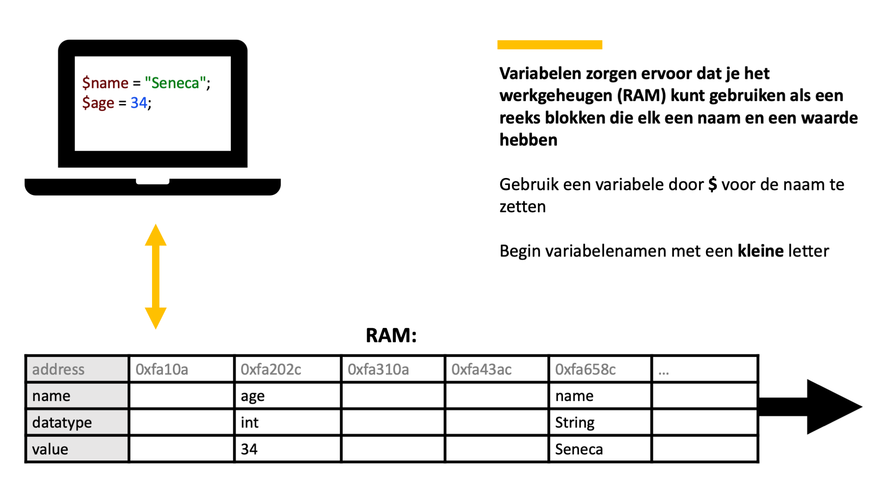
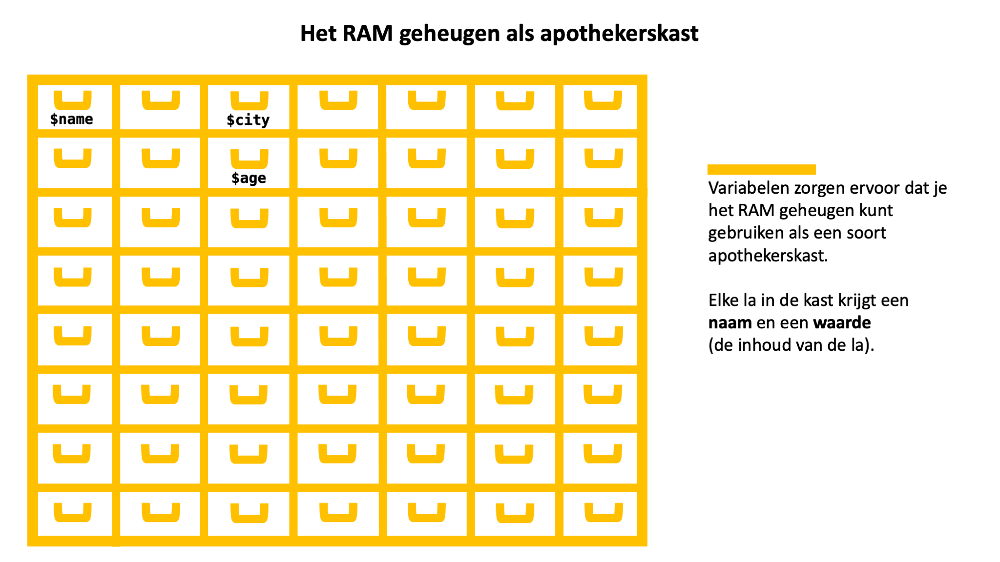

## Onderdeel van
Deze pagina is onderdeel van het **PHP basiskennis**
onderwijsmateriaal.

Voor een overzicht, ga naar **[PHP Basis: Overzicht](../php-basis)**.

## Slides







### Downloads

[[pdf](php-basis-variabele.pdf)] [[pptx](php-basis-variabele.pptx) (bronbestand)]

## Beschrijving

Met variabelen kun je gegevens in het RAM geheugen opslaan en
opvragen. Variabelen zorgen ervoor dat je het RAM geheugen kunt
gebruiken als een soort apothekerskast. Elke la in de kast krijgt een
naam en een inhoud (die noemen we "waarde").

## Voorbeeld

```php
// opslaan (in RAM)
$city = 'Maastricht';
    
// op het scherm weergeven
echo $city;
    
// nieuwe waarde toekennen
$city = "Groningen";
```

## Externe documentatie
De officiële PHP documentatie mbt variabelen vind je op:

https://www.php.net/manual/en/language.variables.basics.php

## Oefeningen
Komt nog.
